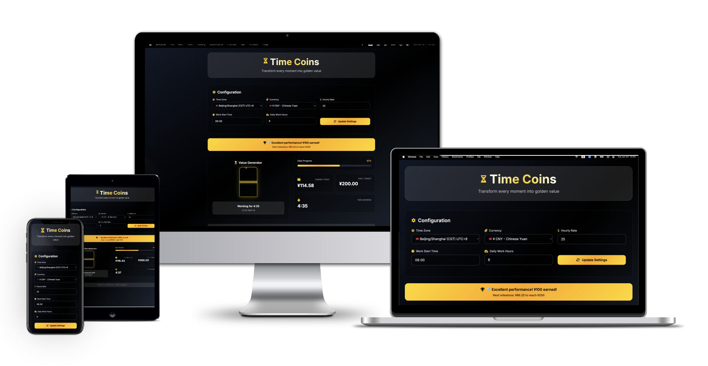

# 一寸光阴一寸金 Time Coins

[](https://github.com/ktwu01/time-coins) [](https://github.com/ktwu01/time-coins/fork) 

> **Transform every moment into golden value** ✨  
> 基于时间流逝简单估算你工作产生的💰现金流

[](README.md) [](README.CN.md)

---

## 🎯 项目简介

Time Coins 是一个优雅的时间价值可视化工具，帮助您实时追踪工作时间的金钱价值。通过精美的沙漏动画和金币效果，让时间的价值变得可见、可感知。

### ✨ 核心特性

- **🏺 优雅沙漏动画** - 实时显示时间流逝的视觉效果
- **💰 动态金币系统** - 持续显示milestones成就和收入累积
- **🌍 全球时区支持** - 支持20+主要时区自动配置
- **💱 多货币单位** - 支持USD、EUR、GBP、JPY等15+主流货币
- **📱 响应式设计** - 完美适配桌面端和移动设备
- **🎨 玻璃渐变风格** - 采用现代glassmorphism设计语言


*优雅的黑白金配色方案，营造尊贵典雅的使用体验*

---

## 🚀 功能特色

### 💼 智能工作追踪
- 自动检测工作时间段
- 实时计算收入累积
- 动态进度条显示当日完成度
- 里程碑成就系统

### ⚙️ 灵活配置
- 自定义时薪设置
- 可调节工作开始时间
- 自定义每日工作时长
- 一键更新所有配置

### 🎭 视觉体验
- 平滑的金币掉落动画
- 优雅的悬浮效果
- 渐变闪烁反馈
- 深度玻璃形态效果

---

## 📸 界面预览

| 主界面 | 设置面板 | 移动端 |
|--------|----------|--------|
|  |  |  |
| 沙漏动画与实时统计 | 全局时区和货币配置 | 完美的响应式体验 |

---

## 🛠️ 技术栈

- **前端框架**: Pure HTML5 + Vanilla JavaScript
- **样式系统**: Tailwind CSS 3.0+
- **图标库**: Font Awesome 6.4
- **字体**: Inter (Google Fonts)
- **动画**: CSS3 + JavaScript
- **响应式**: Mobile-first Design

---

## 📦 快速开始

### 在线体验
🌐 **[Live Demo](https://ktwu01.github.io/time-coins/)** - 立即体验无需安装

### 本地运行

```bash
# 克隆项目
git clone https://github.com/ktwu01/time-coins.git

# 进入目录
cd time-coins

# 使用任意HTTP服务器运行
# 方式1: Python
python -m http.server 8000

# 方式2: Node.js
npx serve .

# 方式3: VS Code Live Server
# 右键 index.html -> Open with Live Server
```

访问 `http://localhost:8000` 即可开始使用！

---

## ⚡ 使用指南

### 基础配置
1. **选择时区** - 从下拉菜单选择您的当前时区
2. **设置货币** - 选择您偏好的货币单位
3. **输入时薪** - 填写您的小时工资率
4. **工作时间** - 设置每日开始时间和工作时长
5. **应用设置** - 点击"Update Settings"按钮保存

### 实时监控
- 📊 **进度条** - 查看当日工作完成度
- 💰 **收入统计** - 实时显示已赚取金额
- ⏱️ **时间追踪** - 精确到分钟的工作时长
- 🏆 **成就系统** - 达成里程碑获得庆祝动画

---

## 🎨 设计理念

Time Coins 采用 **"尊贵典雅"** 的设计哲学：

- **配色方案**: 黑色主调 + 白色文字 + 金色点缀
- **视觉层次**: 玻璃形态的层次分明
- **交互反馈**: 微妙而优雅的动画效果
- **用户体验**: 简约而不简单的操作流程

---

## 📋 更新日志

### v2.0.0 (Current)
- ✅ **[最新]** 采用了尊贵典雅的现代设计风格
- ✅ **[最新]** 增加了一些货币单位
- ✅ **[最新]** add currencies; modified LICENSE file
- ✅ **[最新]** add meta tags for SEO
- ✅ **[最新]** add Google tag
- ✅ **[最新]** 持续显示milestones
- ✅ **[最新]** 彻底更新了动态货币单位

### v1.0.0
- ✅ 动态货币单位
- ✅ 持续显示模式
- ✅ 全球时区专家级配置完成
- ✅ add页面关闭确认提示

---

## 🤝 贡献指南

我们欢迎各种形式的贡献！

### 如何贡献
1. Fork 本项目
2. 创建特性分支 (`git checkout -b feature/AmazingFeature`)
3. 提交更改 (`git commit -m 'Add some AmazingFeature'`)
4. 推送到分支 (`git push origin feature/AmazingFeature`)
5. 创建 Pull Request

### 贡献方向
- 🐛 Bug 修复
- ✨ 新功能开发
- 📝 文档改进
- 🎨 UI/UX 优化
- 🌍 国际化支持

---

## 📄 许可证

本项目采用 MIT 许可证 - 查看 [LICENSE](LICENSE) 文件了解详情

---

## 🙏 致谢

- **Design Inspiration**: Glassmorphism design trends
- **Icons**: Font Awesome community
- **Fonts**: Google Fonts team
- **CSS Framework**: Tailwind CSS team

---

## 📞 联系方式

- **GitHub**: [@ktwu01](https://github.com/ktwu01)
- **Issues**: [项目问题报告](https://github.com/ktwu01/time-coins/issues)
- **Discussions**: [功能讨论区](https://github.com/ktwu01/time-coins/discussions)

---

<div align="center">

### ⭐ 如果这个项目对你有帮助，请给个星星支持一下！

[](https://github.com/ktwu01/time-coins) [](https://github.com/ktwu01/time-coins/fork)

**⏰ Time is money, make every moment count! 一寸光阴一寸金！**

</div>