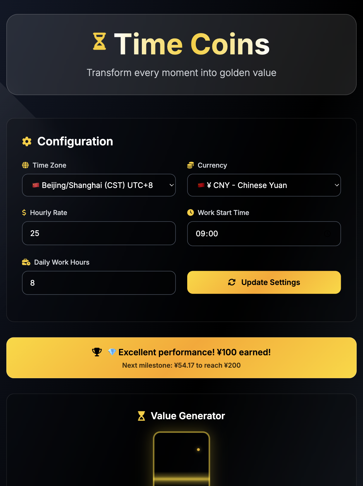
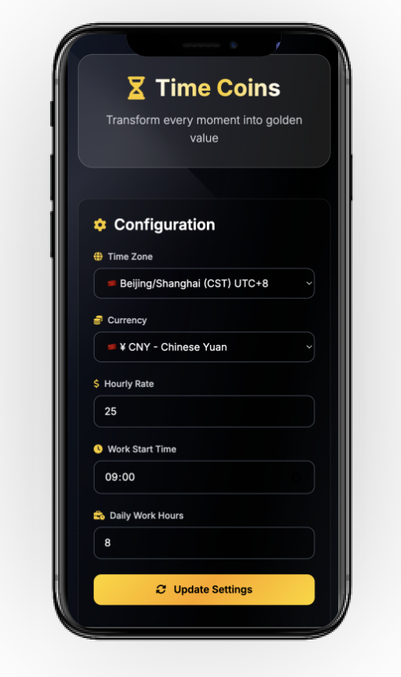
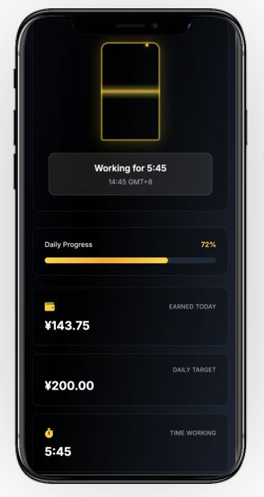

# 一寸光阴一寸金 Time Coins - 实时收入追踪器 💰


**Vue 版本**：本仓库现已升级为完整的 Vue 3 + Vite 实现，旧的静态页面保留在 `legacy-index.html`。

> **注意：** 现在主 `index.html` 仅作为 Vue 3 应用的挂载点，所有新功能、修复和改进都在 `src/` 目录下进行。原始静态 HTML/JS 版本保留在 `legacy-index.html` 供参考。

[](https://ktwu01.github.io/time-coins/) [](https://github.com/ktwu01/time-coins) [](https://github.com/ktwu01/time-coins/fork) 

> **让每一刻都闪闪发光** ✨  
> 用精美的沙漏动画和里程碑庆祝实时可视化您的工作收入

[](README.md) [](README.CN.md)

---

## 🎯 什么是时间金币？

### **[点这里，在线演示](https://ktwu01.github.io/time-coins/)** 

立即体验时间金币，无需安装


*优雅的黑白金配色方案，营造尊贵的用户体验*

Time Coins 是一个优雅的**实时收入追踪工具**，将您的工作时间转化为可视化的黄金价值。通过精美的沙漏动画实时观看收入增长，用金色粒子效果庆祝里程碑成就，在整个工作日保持动力。

专为**自由职业者**、**远程工作者**、**按时计费员工**以及任何想要可视化时间货币价值的人设计。

### ✨ 核心特色

- **🏺 精美沙漏动画** - 观看金色粒子随时间流逝而掉落
- **💰 实时收入追踪** - 每分钟更新的收入显示
- **🏆 里程碑庆祝系统** - 达成目标时的满足感动画
- **🌍 全球时区支持** - 支持50+时区，自动检测
- **💱 多货币支持** - 33种货币，智能地区检测
- **📱 响应式设计** - 完美适配桌面、平板和手机
- **🎨 毛玻璃UI** - 现代优雅设计，流畅动画效果

---

## 🚀 核心功能

### 💼 智能工作追踪
- **自动收入计算** - 基于您的时薪和工作安排
- **实时进度条** - 显示每日完成百分比
- **工作状态检测** - (工作前/工作中/工作完成)
- **自定义工作时间** - 灵活的开始时间和时长设置

### 🏅 成就系统
- **6个里程碑层级**：¥10, ¥50, ¥100, ¥200, ¥500, ¥1000（货币可调）
- **庆祝动画** - 达成里程碑时的精美效果
- **进度追踪** - 显示到下一个里程碑的进度
- **智能里程碑管理** - 防止重复庆祝

### ⚙️ 灵活配置
- **自定义时薪** - 支持小数精度
- **个性化工作安排** - 设置每日开始时间和工作时长
- **时区选择** - 从50+个全球选项中选择
- **货币偏好** - 支持33+种货币
- **即时设置预览** - 实时验证配置

### 🌐 国际化就绪
- **双语界面** - (中文/英文)一键切换
- **智能语言检测** - 从浏览器偏好自动识别
- **本地化货币名称** - 和格式化显示
- **文化里程碑适配** - 适应不同地区文化

---

## 📸 界面预览

| 主控制台 | 设置面板 | 移动端体验 |
|----------|----------|------------|
|  |  |  |
| 实时收入显示配沙漏动画 | 全球时区和货币配置 | 所有设备的响应式设计 |

---

## 🛠️ 技术栈

- **前端框架**: Vue 3 + Vite
- **样式系统**: Tailwind CSS 3.0+ 配自定义毛玻璃效果
- **图标库**: Font Awesome 6.4 提供清晰可缩放图标
- **字体**: Google Fonts的Inter字体，现代化排版
- **动画效果**: CSS3过渡 + JavaScript实现流畅交互
- **架构设计**: 模块化ES6+ 配智能缓存系统

---

## 📦 快速开始

### 🌐 立即体验
**[在线演示](https://ktwu01.github.io/time-coins/)** - 立即体验时间金币，无需安装

### 💻 本地开发

```bash
# 克隆仓库
git clone https://github.com/ktwu01/time-coins.git

# 进入目录
cd time-coins

# 安装依赖（需要网络）
npm install

# 启动开发服务器
npm run dev
```

访问 `http://localhost:5173` 查看 Vue 版本

## 🏛️ 旧版说明

原始静态 HTML/JS 版本已保留在 [`legacy-index.html`](legacy-index.html) 文件中，供参考。

- **如何使用旧版：**
  - 直接用浏览器打开 `legacy-index.html`（无需构建或服务器）。
  - 该版本为纯 HTML5 + 原生 JS，不包含 Vue 新特性和增强。
  - 旧版无需 npm、Vite 或任何构建步骤。

---

## ⚡ 使用指南

### 初始设置（30秒完成）
1. **选择时区** - 从50+个全球时区中选择
2. **选择货币** - 从33种支持的货币中选择
3. **输入时薪** - 填写您的每小时收入
4. **设置工作安排** - 定义每日开始时间和工作时长
5. **保存设置** - 点击"更新设置"开始追踪

### 实时监控
- 📊 **进度可视化** - 观看每日完成百分比
- 💰 **实时收入计数器** - 每分钟更新的收入显示
- ⏱️ **精确时间追踪** - 精确到分钟
- 🏆 **里程碑庆祝** - 享受满足感的成就动画
- 🔮 **沙漏动画** - 美丽的金色粒子随时间流动

---

## 🎨 设计理念

时间金币采用**"优雅奢华"**的设计哲学：

- **高端色彩搭配**: 深黑色 + 纯白色 + 光泽金色点缀
- **毛玻璃效果**: 分层透明度配微妙模糊效果
- **微交互设计**: 令人愉悦的悬停状态和按钮反馈
- **渐进增强**: 默认美观，JavaScript增强体验

---

## 📋 版本历史

### v2.0.0 (当前版本)
- ✅ **[最新]** 采用高端毛玻璃UI重新设计
- ✅ **[最新]** 扩展货币支持（33种货币）
- ✅ **[最新]** 增强里程碑庆祝系统
- ✅ **[最新]** 改进SEO优化，添加元标签
- ✅ **[最新]** 集成Google Analytics
- ✅ **[最新]** 持续里程碑显示
- ✅ **[最新]** 动态货币单位系统

### v1.0.0
- ✅ 核心收入追踪功能
- ✅ 基础沙漏动画
- ✅ 全球时区配置
- ✅ 页面关闭确认对话框
- ✅ 初始多语言支持

---

## 🤝 参与贡献

我们欢迎来自全球开发者的贡献！

### 如何贡献
1. **Fork** 此仓库
2. **创建** 功能分支 (`git checkout -b feature/AmazingFeature`)
3. **提交** 更改 (`git commit -m 'Add some AmazingFeature'`)
4. **推送** 到分支 (`git push origin feature/AmazingFeature`)
5. **创建** Pull Request

### 贡献方向
- 🐛 **Bug修复** - 帮助提高稳定性
- ✨ **新功能** - 添加令人兴奋的功能
- 📝 **文档改进** - 完善指南和示例
- 🎨 **UI/UX增强** - 优化用户体验
- 🌍 **国际化** - 添加更多语言支持
- 🔧 **性能优化** - 优化动画和计算

---

## 📄 许可证

本项目采用 知识共享署名-非商业性使用-禁止演绎 4.0 国际许可协议 - 查看 [LICENSE](LICENSE) 文件了解详情。

---

## 🙏 致谢

- **设计灵感**: 现代毛玻璃和高端仪表板趋势
- **图标库**: Font Awesome社区提供的精美图标
- **字体排版**: Google Fonts团队的优雅Inter字体家族
- **CSS框架**: Tailwind CSS提供快速一致的样式
- **动画技巧**: CSS-Tricks和CodePen社区示例

---

## 📞 联系我们

- **GitHub主页**: [@ktwu01](https://github.com/ktwu01)
- **问题报告**: [Bug报告和功能请求](https://github.com/ktwu01/time-coins/issues)
- **讨论区**: [社区论坛](https://github.com/ktwu01/time-coins/discussions)
- **在线演示**: [立即试用时间金币](https://ktwu01.github.io/time-coins/)

---

<div align="center">

### ⭐ 如果这个项目帮助您可视化时间价值，请给个星星支持！

[](https://github.com/ktwu01/time-coins) [](https://github.com/ktwu01/time-coins/fork)

**⏰ 一寸光阴一寸金，让每一刻都有价值！今天就开始转变您的生产力！**

*完美适用于自由职业者、远程工作者、咨询师和所有珍惜时间的人* 💎

</div>