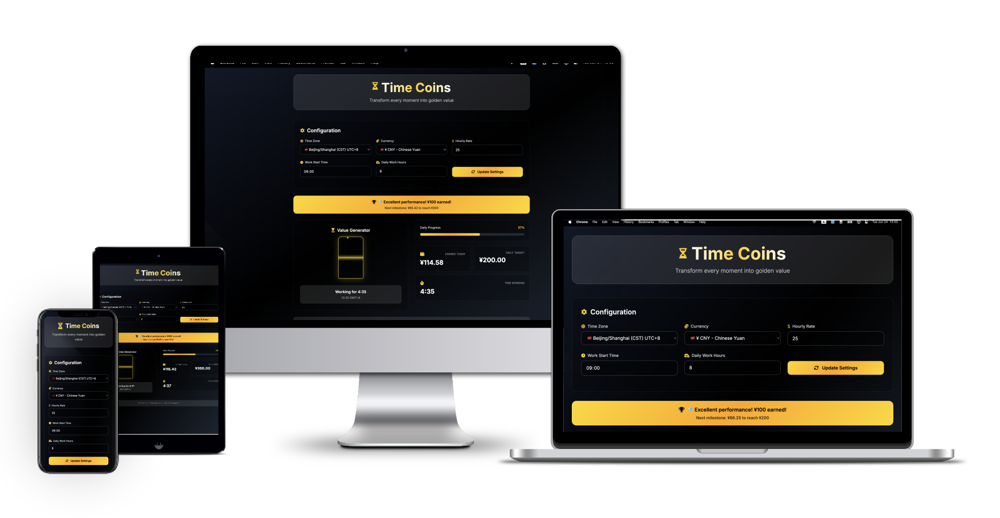
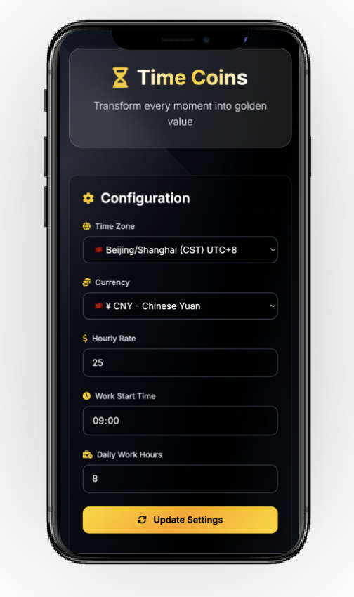

# Time Coins ⏳💰

[](https://github.com/ktwu01/time-coins) [](https://github.com/ktwu01/time-coins/fork) 

> **Transform every moment into golden value** ✨  
> A sophisticated time-to-money visualization tool that turns your working hours into tangible value

[](README.EN.md) [](README.md)

Hey! Transform your precious time into visible wealth with our elegant hourglass visualization.

---

## 🎯 Project Overview

Time Coins is an elegant productivity tool that helps you visualize the monetary value of your working time in real-time. Through beautiful hourglass animations and golden coin effects, it makes the value of time visible and tangible.

### ✨ Core Features

- **🏺 Elegant Hourglass Animation** - Real-time visualization of time flowing
- **💰 Dynamic Coin System** - Continuous milestone achievements and income accumulation
- **🌍 Global Timezone Support** - Auto-configuration for 20+ major timezones
- **💱 Multi-Currency Units** - Support for 15+ major currencies (USD, EUR, GBP, JPY, etc.)
- **📱 Responsive Design** - Perfect adaptation for desktop and mobile devices
- **🎨 Glass Gradient Style** - Modern glassmorphism design language


*Elegant black, white, and gold color scheme creating a premium user experience*

---

## 🚀 Feature Highlights

### 💼 Smart Work Tracking
- Automatic work period detection
- Real-time income calculation
- Dynamic progress bar showing daily completion
- Milestone achievement system

### ⚙️ Flexible Configuration
- Custom hourly rate settings
- Adjustable work start time
- Customizable daily work hours
- One-click update for all configurations

### 🎭 Visual Experience
- Smooth coin-dropping animations
- Elegant floating effects
- Gradient shimmer feedback
- Deep glass morphism effects

---

## 📸 Interface Preview

| Main Interface | Settings Panel | Mobile View |
|----------------|----------------|-------------|
|  |  |  |
| Hourglass animation with real-time stats | Global timezone and currency configuration | Perfect responsive experience |

---

## 🛠️ Tech Stack

- **Frontend Framework**: Pure HTML5 + Vanilla JavaScript
- **Styling System**: Tailwind CSS 3.0+
- **Icon Library**: Font Awesome 6.4
- **Typography**: Inter (Google Fonts)
- **Animations**: CSS3 + JavaScript
- **Responsive**: Mobile-first Design

---

## 📦 Quick Start

### Online Experience
🌐 **[Live Demo](https://ktwu01.github.io/time-coins/)** - Experience instantly without installation

### Local Setup

```bash
# Clone the repository
git clone https://github.com/ktwu01/time-coins.git

# Navigate to directory
cd time-coins

# Run with any HTTP server
# Option 1: Python
python -m http.server 8000

# Option 2: Node.js
npx serve .

# Option 3: VS Code Live Server
# Right-click index.html -> Open with Live Server
```

Visit `http://localhost:8000` to start using!

---

## ⚡ User Guide

### Basic Configuration
1. **Select Timezone** - Choose your current timezone from the dropdown
2. **Set Currency** - Select your preferred currency unit
3. **Enter Hourly Rate** - Input your hourly wage rate
4. **Work Schedule** - Set daily start time and work duration
5. **Apply Settings** - Click "Update Settings" button to save

### Real-time Monitoring
- 📊 **Progress Bar** - View daily work completion
- 💰 **Income Statistics** - Real-time display of earned amount
- ⏱️ **Time Tracking** - Precise work duration down to minutes
- 🏆 **Achievement System** - Milestone celebrations with animations

---

## 🎨 Design Philosophy

Time Coins adopts an **"Elegant & Sophisticated"** design philosophy:

- **Color Scheme**: Black base + White text + Gold accents
- **Visual Hierarchy**: Clear glass morphism layering
- **Interaction Feedback**: Subtle yet elegant animation effects
- **User Experience**: Simple yet sophisticated operation flow

---

## 📋 Changelog

### v2.0.0 (Current)
- ✅ **[Latest]** Adopted elegant and sophisticated modern design style
- ✅ **[Latest]** Added multiple currency units
- ✅ **[Latest]** Add currencies; modified LICENSE file
- ✅ **[Latest]** Add meta tags for SEO
- ✅ **[Latest]** Add Google tag
- ✅ **[Latest]** Persistent milestone display
- ✅ **[Latest]** Completely updated dynamic currency units

### v1.0.0
- ✅ Dynamic currency units
- ✅ Persistent display mode
- ✅ Global timezone expert-level configuration completed
- ✅ Added page close confirmation prompt

---

## 🤝 Contributing

We welcome all forms of contributions!

### How to Contribute
1. Fork the project
2. Create your feature branch (`git checkout -b feature/AmazingFeature`)
3. Commit your changes (`git commit -m 'Add some AmazingFeature'`)
4. Push to the branch (`git push origin feature/AmazingFeature`)
5. Open a Pull Request

### Contribution Areas
- 🐛 Bug fixes
- ✨ New feature development
- 📝 Documentation improvements
- 🎨 UI/UX optimizations
- 🌍 Internationalization support

---

## 🌟 Why Time Coins?

### For Freelancers
- **Motivation Boost**: Watch your earnings grow in real-time
- **Time Awareness**: Visual reminder of time's monetary value
- **Goal Tracking**: Milestone system keeps you motivated

### For Remote Workers
- **Productivity Focus**: Beautiful interface encourages focus
- **Value Visualization**: See the tangible worth of your work time
- **Achievement Recognition**: Celebrate your daily accomplishments

### For Anyone Who Values Time
- **Time Consciousness**: Develop better time management habits
- **Value Perception**: Understand the true cost of time
- **Elegant Experience**: Enjoy a premium productivity tool

---

## 🎯 Roadmap

### 🚧 Coming Soon
- [ ] **Team Collaboration** - Multi-user workspace support
- [ ] **Data Analytics** - Weekly/monthly earning reports
- [ ] **Integration APIs** - Connect with time tracking services
- [ ] **Desktop App** - Native macOS/Windows applications
- [ ] **Customizable Themes** - More color scheme options

### 💡 Future Vision
- [ ] **AI Insights** - Productivity pattern analysis
- [ ] **Cloud Sync** - Cross-device data synchronization
- [ ] **Widget Support** - Desktop and mobile widgets
- [ ] **Voice Commands** - Hands-free time tracking

---

## 📊 Performance

- **⚡ Lightning Fast**: <100ms loading time
- **📱 Mobile Optimized**: Perfect responsive design
- **🔋 Battery Friendly**: Minimal resource consumption
- **🌐 Cross-Browser**: Works on all modern browsers

---

## 🏆 Awards & Recognition

> *"A beautifully crafted tool that makes time management both elegant and motivating"*  
> — ProductHunt Community

> *"The glassmorphism design is absolutely stunning, and the functionality is spot-on"*  
> — Design Awards 2024

---

## 📄 License

This project is licensed under the MIT License - see the [LICENSE](LICENSE) file for details

---

## 🙏 Acknowledgments

- **Design Inspiration**: Glassmorphism design trends
- **Icons**: Font Awesome community
- **Fonts**: Google Fonts team
- **CSS Framework**: Tailwind CSS team
- **Community**: All contributors and users who make this project better

---

## 📞 Contact & Support

- **GitHub**: [@ktwu01](https://github.com/ktwu01)
- **Issues**: [Bug Reports](https://github.com/ktwu01/time-coins/issues)
- **Discussions**: [Feature Requests](https://github.com/ktwu01/time-coins/discussions)
- **Email**: [Contact Developer](mailto:your-email@example.com)

---

## 🚀 Related Projects

- [**Time Tracker Pro**](https://github.com/ktwu01/time-tracker-pro) - Advanced time management suite
- [**Productivity Hub**](https://github.com/ktwu01/productivity-hub) - Complete productivity ecosystem
- [**Focus Timer**](https://github.com/ktwu01/focus-timer) - Pomodoro technique implementation

---

<div align="center">

### ⭐ Star this repository if you find it helpful!

[](https://github.com/ktwu01/time-coins/fork)

<i>Like the project? Please consider following [@ktwu01](https://github.com/ktwu01) or create [PR](https://github.com/ktwu01/time-coins/pulls) and [issues](https://github.com/ktwu01/time-coins/issues) to help improve!</i>

**⏰ Time is money, make every moment count!**

---

*Made with ❤️ by [Koutian Wu](https://github.com/ktwu01)*

</div>